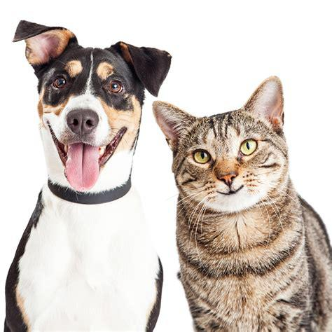

# Fast Style Transfer

> Convert photos and videos to artwork

<div align='center'>
  
  
  
</div>

Stylize any photo or video in style of famous paintings using Neural Style Transfer.
- This is hundreds of times faster than the optimization-based method presented by [Gatys et al](https://arxiv.org/abs/1508.06576) so called fast style transfer.
- We train a feedforward network that apply artistic styles to images using loss function defined in [Gatys et al](https://arxiv.org/abs/1508.06576) paper.
- Feed forward network is a residual autoencoder network that takes content image as input and spits out stylized image.
- Model also uses instance normalization instead of batch normalization based on the paper [Instance Normalization: The Missing Ingredient for Fast Stylization](https://arxiv.org/abs/1607.08022)
- Training is done by using perceptual loss defined in paper [Perceptual Losses for Real-Time Style Transfer and Super-Resolution](https://arxiv.org/abs/1603.08155).
- Vgg19 is used to calculate perceptual loss more working described on paper.

### Requirements
#### System
- For inferencing or generating images any system will work. But size of output image is limited as per system. Large images needs more momory to process. GPU is not must for inferencing but having it will be advantageous.
- For training GPU is must with tensorflow-gpu and cuda installed.
- If there is no access to GPU but want to train there is a notebook `Fast_Style_Transfer_Colab.ipynb` open it in colab and train. For saving model checkpoints google drive is used. You can trust this notebook but I do not take any responsibility for data loss from google drive. Before running check the model save checkpoints path as it can override existing data with same name.
- Training takes around 8 hours in colab.

#### Packages
- `tensorflow-gpu>=2.0` or `tensorflow>=2.0`
- `numpy`
- `matplotlib`
- `pillow`
- `opencv-python`

> This implementation is tested with tensorflow-gpu 2.0 and tensorflow-gpu 2.2 in Windows 10 and Linux

### Get Started
- Install Python3 or anaconda and install them. For detailed steps follow installation guide for [Python3](https://realpython.com/installing-python/) and [Anaconda](https://docs.anaconda.com/anaconda/install/)
- Install above packages via pip or conda. For detailed steps follow guide for [pip](https://docs.python.org/3/installing/index.html) and [conda](https://docs.anaconda.com/anaconda/user-guide/tasks/install-packages/)
- Download some [Download Pretrained Models](https://www.dropbox.com/sh/dkmy123bxk7f1s0/AAA-opMlprMhssPJCR1I1k4Qa?dl=0) trained of different paintings to start playing without need to train network
- copy and unzip checkpoints inside `data/models`
- run scripts for image and video stylization
#### Additional guides:
If stuck on Get Started Step 1 and Step 2 follow these additional resources
- [Python Installation](https://www.youtube.com/watch?v=YYXdXT2l-Gg&list)
- [pip and usage](https://www.youtube.com/watch?v=U2ZN104hIcc)
- [Anaconda installation and using conda](https://www.youtube.com/watch?v=YJC6ldI3hWk)


### [Download Pretrained Models](https://www.dropbox.com/sh/dkmy123bxk7f1s0/AAA-opMlprMhssPJCR1I1k4Qa?dl=0)

### How to use
- Input Parameters for a script can be set by using config file or using command line arguments.
- All configs file are located inside `configs` folder.
- If config file path is passed as command line argument then all parameters will be read by script from it, otherwise input parameters are needed to be passed as command line arguments. Using config files will reduce lines to be typed in command line also easy to track all the parameters that can be tweaked.

## Image Stylization
- Single Image
Style one image and terminates
```bash
python style_image.py --config=configs/image_config.json
```
or 
```bash
python style_image.py --checkpoint data/models/udnie/model_checkpoint.ckpt --image data/images/content.jpg --image_size 1366 768 --output output/styled.jpg
```
- Multiple Images
Style all images inside a folder
```bash
python style_multi_images.py --config=configs/multi_images_config.json
```
or 
```bash
python style_multi_images.py --checkpoint data/models/udnie/model_checkpoint.ckpt --path data/images/content.jpg --image_size 1366 768 --output output/styled.jpg
```

## Video Stylization
<div align='center'>
  <a href="http://www.youtube.com/watch?v=GrS4rWifdko"></a>
</div>

Use `style_video.py` to transfer style into a video.To view all the possible input parameters view its `configs/video_config.json` these parameters can be passed as command line arguments as well.

```bash
python style_video.py --config=configs/video_config.json
```

## Webcam Stylization
<div align='center'>
  
</div>

Use `style_webcam.py` to transfer style into live webcam recording.To view all the possible input parameters view its `configs/webcam_config.json` these parameters can be passed as command line arguments as well.

```bash
python style_webcam.py --config=configs/webcam_config.json
```

## Training a new style
- Download [coco 2014](http://images.cocodataset.org/zips/train2014.zip) dataset and extract it inside data/train directory. It can be extracted to anywhere in computer as long you defined its path inside `configs/train.json`. or in command line arguments. You can also use any other dataset with images, I have tried with some small datasets but results were not good. It needs more experimentation.
```bash
!wget http://images.cocodataset.org/zips/train2014.zip data/train
!unzip -qq data/train/train2014.zip
```
- Get your style image ready. It can be a file link over http or path to file in local
- Edit `configs/train.json` with parameters as your linking especially `checkpoint`, `style_image` and `train_path`. You can also pass these as command line arguments when running `train.py` script. It depends on your preferences.
- Run `train.py` script
```bash
python train.py --config=configs/train_config.json
```
- If want to train style images in google colab a notebook `Fast_Style_Transfer_Colab.ipynb` is provided. Open it in colab and train. For saving model checkpoints google drive is used. You can trust this notebook but I do not take any responsibility for data loss from google drive. Before running check the model save checkpoints path as it can override existing data with same name.

### Stylized Results
<div align='center'>
  
</div>
<div align='center'>
  
</div>
<div align='center'>
  
</div>
<div align='center'>
  
</div>
<div align='center'>
  
</div>
<div align='center'>
  
</div>

## Gatys Style Transfer
[](http://www.youtube.com/watch?v=weVfBfWVuZw)
We can also perform gatys style transfer by using `slow_style_transfer.py` script. You can use it for styling images but it takes more time to generate an image. To view all the possible input parameters view `configs/slow_style_config.json` these parameters can be passed as command line arguments as well.
```bash
python slow_style_transfer.py --config=configs/slow_style_config.json
```

## Contribution
Contributions are highly welcome that will improve quality of project. Folks with high end machines are welcome to train new styles and contribute. For contribution [Contact me](www.tarunbisht.com/contact)

## License
Copyright (c) 2020 Tarun Bisht. Free for personal or research use. [Contact me](www.tarunbisht.com/contact) for commercial use.

## Attributions
- [A Neural Algorithm of Artistic Style](https://arxiv.org/abs/1508.06576)
- [Perceptual Losses for Real-Time Style Transfer and Super-Resolution](https://arxiv.org/abs/1603.08155)
- [Instance Normalization: The Missing Ingredient for Fast Stylization](https://arxiv.org/abs/1607.08022)
- Image from [Unsplash](https://unsplash.com/s/photos/deep-meaning?utm_source=unsplash&amp;utm_medium=referral&amp;utm_content=creditCopyText) by [Heather Gill](https://unsplash.com/@heathergill?utm_source=unsplash&amp;utm_medium=referral&amp;utm_content=creditCopyText)

## Support
Support this project through [patreon](https://www.patreon.com/tarunbisht)
